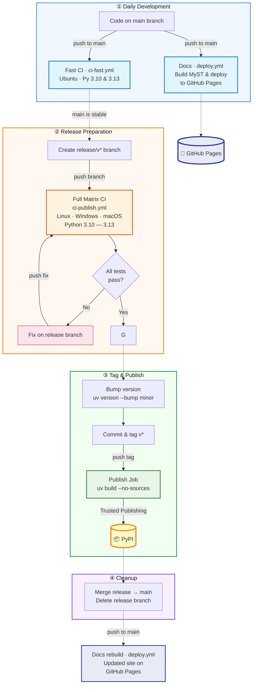

# Publishing and Deployment Workflow

`xmris` strictly separates **CI (testing)** from **CD (publishing)** to avoid the "bump version → push → CI fails → bump again" cycle. Never bump the version until all tests pass.

We use `uv` for dependency management and GitHub Actions for testing across Python 3.10–3.13 on Ubuntu, Windows, and macOS.

---

## ① Daily Development

Work on `main`. Every push triggers **Fast CI** (`ci-fast.yml`) — a smoke test on Ubuntu with Python 3.10 and 3.13.

- **Do not** bump the version.
- Just code, push, and iterate.

Every push to `main` also triggers the **Documentation** workflow (`deploy.yml`), which builds the MyST documentation site and deploys it to GitHub Pages.

---

## ② Release Preparation

When `main` is stable, create a release branch:

```bash
git checkout -b release/v0.2.0
git push origin release/v0.2.0
```

This triggers the **Full CD Pipeline** (`ci-publish.yml`) — a 12-job matrix covering all OS and Python combinations.

### If tests fail

Do not bump the version. Fix directly on the release branch and push:

```bash
git commit -am "fix: windows path issue" && git push
```

The full matrix re-runs automatically. Repeat until green.

```{note}
**macOS exception:** Due to an upstream `pyAMARES` issue, macOS jobs use `continue-on-error: true`. macOS failures won't block the pipeline.
```

---

## ③ Tag & Publish

Once the matrix is fully green, bump, tag, and ship:

```bash
uv version --bump minor               # bump version in pyproject.toml
git commit -am "chore: bump version to 0.2.0"
git tag v0.2.0
git push origin v0.2.0         # triggers the publish job
```

```{warning}
The `v*` tag triggers the `publish` job in `ci-publish.yml`. It uses `uv build --no-sources` to strip local Git forks (e.g. the `pyamares` patch) so PyPI users get standard dependencies. Upload uses PyPI Trusted Publishing (OIDC) — no passwords required.
```

---

## ④ Cleanup

Merge the release branch back into `main` and delete it:

```bash
git checkout main
git merge release/v0.2.0
git push origin main
git branch -d release/v0.2.0
```

The Git tag remains as the permanent release marker.

---

## ⑤ Documentation Deployment

Documentation is built and deployed **automatically on every push to `main`** via the `deploy.yml` workflow. There is no manual step required.

### How it works

| Step | Action |
|---|---|
| **Checkout** | Clones the repository (`actions/checkout@v4`) |
| **Setup Pages** | Configures GitHub Pages (`actions/configure-pages@v5`) |
| **Setup uv** | Installs `uv` with dependency caching (`astral-sh/setup-uv@v5`) |
| **Install deps** | `uv sync --only-group dev` — installs only the dev dependency group |
| **Build site** | Runs `uv run docs-api` to generate the API reference, then `uv run myst build --html` inside `docs/` |
| **Upload** | Uploads `docs/_build/html` as a Pages artifact (`actions/upload-pages-artifact@v3`) |
| **Deploy** | Publishes to GitHub Pages (`actions/deploy-pages@v4`) |

The site is served at the base URL `/xmris` (configured via the `BASE_URL` env var). The workflow uses GitHub's OIDC-based Pages deployment — no tokens or secrets needed.

```{note}
The workflow uses `concurrency: group: 'pages'` with `cancel-in-progress: false`, so overlapping pushes to `main` will queue rather than cancel in-flight deployments.
```

---

## Workflow Diagram

