# Publishing and Deployment Workflow

*Scroll down for a workflow diagram.*

---


To prevent the frustrating "bump version -> push -> CI fails -> bump version again" cycle, `xmris` uses a strict separation between **Continuous Integration (Testing)** and **Continuous Deployment (Publishing)**. 

We rely on `uv` for lightning-fast dependency management and GitHub Actions for testing across our supported matrix (Python 3.10–3.13 on Ubuntu, Windows, and macOS).


## 1. Daily Development (The Fast Track)
When you are writing code, fixing bugs, or merging pull requests, you work directly on or merge into the `main` branch. 

Every push to `main` triggers our **Fast CI** (`ci-fast.yml`). This runs a quick "smoke test" using only Ubuntu and Python 3.10 and 3.13. 
* **Goal:** Ensure core functionality isn't broken without burning GitHub Actions minutes.
* **Action:** Just code and push. Do not bump the version number.

## 2. Preparing a Release (The QA Freeze)
When `main` is stable and you are ready to publish a new version (e.g., `0.2.0`), you isolate the code by creating a release branch.

```bash
git checkout -b release/v0.2.0
git push origin release/v0.2.0

```

Pushing a `release/**` branch triggers our **Full CD Pipeline** (`cd.yml`). This spins up the exhaustive 12-job matrix testing all OS and Python combinations.

### What happens if my release didn't pass all tests?

**Do not bump the version!** If the Windows or Ubuntu tests fail, your code is not ready.

1. Fix the bug directly on your active `release/v0.2.0` branch.
2. Commit and push the fix: `git commit -am "fix windows path issue" && git push`
3. The Full CD pipeline will run again.
4. Repeat until the matrix is green.

```{note}
**The macOS Exception:** We currently have an upstream dependency issue with `pyAMARES` on macOS. In the CI matrix, macOS is set to `continue-on-error: true`. If macOS fails, the pipeline will still report as "Successful" overall and allow publishing. 

```

## 3. Tagging and Publishing to PyPI

Once your `release/v0.2.0` branch is completely green across the board, it is time to stamp it and ship it.

Still on your release branch, use `uv` to bump the version, commit the change, tag it, and push the tag:

```bash
# 1. Bump the version in pyproject.toml
uv version minor  # use patch, minor, or major

# 2. Commit the version bump
git commit -am "chore: bump version to 0.2.0"

# 3. Create a Git Tag
git tag v0.2.0

# 4. Push the tag to GitHub (This triggers the PyPI upload!)
git push origin v0.2.0

```

```{warning}
**How the PyPI Upload Works:**
Pushing the `v*` tag triggers the `publish` job in `cd.yml`. 
We use `uv build --no-sources` to build the wheel. This intentionally strips out our local Git forks (like our `pyamares` patch) so that PyPI users download the standard dependencies. The package is then uploaded securely via PyPI Trusted Publishing (OIDC)—no passwords required.

```

## 4. Cleanup (Merging Back)

You successfully published! The last step is to bring your version bump and any OS-specific bug fixes back into `main` so future development includes them.

```bash
git checkout main
git merge release/v0.2.0
git push origin main

```

You can now safely delete the `release/v0.2.0` branch. The Git tag remains as the permanent marker of the release.

## 5. Workflow Diagram

```mermaid
flowchart TD
    subgraph dev ["① Daily Development"]
        A[Code on main branch] -->|push to main| B[Fast CI · ci-fast.yml<br>Ubuntu · Py 3.10 & 3.13]
    end

    B -.->|main is stable| C

    subgraph release ["② Release Preparation"]
        C[Create release/v* branch] -->|push branch| D[Full Matrix CI · cd.yml<br>Linux · Windows · macOS<br>Python 3.10 — 3.13]
        D --> E{All tests<br>pass?}
        E -->|No| F[Fix on release branch]
        F -->|push fix| D
    end

    E -->|Yes| G

    subgraph publish ["③ Tag & Publish"]
        G[Bump version<br>uv version minor] --> H[Commit & tag v*]
        H -->|push tag| I[Publish Job<br>uv build --no-sources]
        I -->|Trusted Publishing| J[(📦 PyPI)]
    end

    J -.-> K

    subgraph cleanup ["④ Cleanup"]
        K[Merge release → main<br>Delete release branch]
    end

    style dev fill:#f0f7ff,stroke:#4a90d9,stroke-width:2px,color:#1a1a1a
    style release fill:#fff8f0,stroke:#e6820e,stroke-width:2px,color:#1a1a1a
    style publish fill:#f0fff0,stroke:#2d8a4e,stroke-width:2px,color:#1a1a1a
    style cleanup fill:#f8f0ff,stroke:#7c4dff,stroke-width:2px,color:#1a1a1a

    style B fill:#e1f5fe,stroke:#0277bd,stroke-width:2px
    style D fill:#fff3e0,stroke:#e65100,stroke-width:2px
    style F fill:#fce4ec,stroke:#c62828
    style I fill:#e8f5e9,stroke:#2e7d32,stroke-width:2px
    style J fill:#fff9c4,stroke:#f57f17,stroke-width:3px
```

