# Publishing and Deployment Workflow

`xmris` strictly separates **CI (testing)** from **CD (publishing)** to avoid the "bump version → push → CI fails → bump again" cycle. Never bump the version until all tests pass.

We use `uv` for dependency management and GitHub Actions for testing across Python 3.10–3.13 on Ubuntu, Windows, and macOS.

---

## ① Daily Development

Work on `main`. Every push triggers **Fast CI** (`ci-fast.yml`) — a smoke test on Ubuntu with Python 3.10 and 3.13.

- **Do not** bump the version.
- Just code, push, and iterate.

---

## ② Release Preparation

When `main` is stable, create a release branch:

```bash
git checkout -b release/v0.2.0
git push origin release/v0.2.0
```

This triggers the **Full CD Pipeline** (`cd.yml`) — a 12-job matrix covering all OS and Python combinations.

### If tests fail

Do not bump the version. Fix directly on the release branch and push:

```bash
git commit -am "fix: windows path issue" && git push
```

The full matrix re-runs automatically. Repeat until green.

```{note}
**macOS exception:** Due to an upstream `pyAMARES` issue, macOS jobs use `continue-on-error: true`. macOS failures won't block the pipeline.
```

---

## ③ Tag & Publish

Once the matrix is fully green, bump, tag, and ship:

```bash
uv version --bump minor               # bump version in pyproject.toml
git commit -am "chore: bump version to 0.2.0"
git tag v0.2.0
git push origin v0.2.0         # triggers the publish job
```

```{warning}
The `v*` tag triggers the `publish` job in `cd.yml`. It uses `uv build --no-sources` to strip local Git forks (e.g. the `pyamares` patch) so PyPI users get standard dependencies. Upload uses PyPI Trusted Publishing (OIDC) — no passwords required.
```

---

## ④ Cleanup

Merge the release branch back into `main` and delete it:

```bash
git checkout main
git merge release/v0.2.0
git push origin main
git branch -d release/v0.2.0
```

The Git tag remains as the permanent release marker.

---

## Workflow Diagram

```mermaid
flowchart TD
    subgraph dev ["① Daily Development"]
        A[Code on main branch] -->|push to main| B[Fast CI · ci-fast.yml<br>Ubuntu · Py 3.10 & 3.13]
    end

    B -.->|main is stable| C

    subgraph release ["② Release Preparation"]
        C[Create release/v* branch] -->|push branch| D[Full Matrix CI · cd.yml<br>Linux · Windows · macOS<br>Python 3.10 — 3.13]
        D --> E{All tests<br>pass?}
        E -->|No| F[Fix on release branch]
        F -->|push fix| D
        E -->|Yes| G
    end

    G -.-> H

    subgraph publish ["③ Tag & Publish"]
        H[Bump version<br>uv version --bump minor] --> I[Commit & tag v*]
        I -->|push tag| J[Publish Job<br>uv build --no-sources]
        J -->|Trusted Publishing| K[(📦 PyPI)]
    end

    K -.-> L

    subgraph cleanup ["④ Cleanup"]
        L[Merge release → main<br>Delete release branch]
    end

    style dev fill:#f0f7ff,stroke:#4a90d9,stroke-width:2px,color:#1a1a1a
    style release fill:#fff8f0,stroke:#e6820e,stroke-width:2px,color:#1a1a1a
    style publish fill:#f0fff0,stroke:#2d8a4e,stroke-width:2px,color:#1a1a1a
    style cleanup fill:#f8f0ff,stroke:#7c4dff,stroke-width:2px,color:#1a1a1a

    style B fill:#e1f5fe,stroke:#0277bd,stroke-width:2px
    style D fill:#fff3e0,stroke:#e65100,stroke-width:2px
    style F fill:#fce4ec,stroke:#c62828
    style J fill:#e8f5e9,stroke:#2e7d32,stroke-width:2px
    style K fill:#fff9c4,stroke:#f57f17,stroke-width:3px
```

