```mermaid
flowchart TD
    %% 1. Reusable Class Definitions
    classDef component fill:#ffffff,stroke:#adb5bd,stroke-width:1px,stroke-dasharray: 2 2
    classDef dataArray fill:#f8f9fa,stroke:#ced4da,stroke-width:2px
    classDef accessor fill:#ffe066,stroke:#f5b041,stroke-width:2px,color:#333
    classDef native fill:#e2e3e5,stroke:#6c757d,stroke-width:2px,color:#333
    classDef output fill:#d4edda,stroke:#28a745,stroke-width:2px
    classDef package fill:#e6f2ff,stroke:#0066cc,stroke-width:2px,stroke-dasharray: 5 5

    %% 2. The building blocks
    subgraph Components ["DataArray Components"]
        direction LR
        NP["Raw NumPy Array<br><span style='color:#6c757d; font-size:0.9em; font-style:italic;'>Complex FID data</span>"]:::component
        Dims["Dimensions<br><span style='color:#6c757d; font-size:0.9em; font-style:italic;'>'time', 'repetitions'</span>"]:::component
        Coords["Coordinates<br><span style='color:#6c757d; font-size:0.9em; font-style:italic;'>- array of fid times [s]<br>- array of repetition times [s]</span>"]:::component
        Meta["Metadata (attrs)<br><span style='color:#6c757d; font-size:0.9em; font-style:italic;'>b0_field, reference_frequency</span>"]:::component
    end

    %% 3. The Core Object
    Components --> In["📦 xarray.DataArray<br><span style='color:#6c757d; font-size:0.95em; font-family:monospace;'>fid_data</span>"]:::dataArray

    %% 4a. The Native xarray benefit
    In --> Nat{"Native Methods"}:::native
    Nat -->|"<span style='font-family:monospace;'>fid_data.mean(dim='repetitions')</span>"| OutNat["📉 Averaged FID DataArray"]:::output

    %% 4b. The Custom processing pipeline
    In --> Acc{"⚙️ .xmr accessor"}:::accessor
    Acc -->|"<span style='font-family:monospace;'>fid_data.xmr.to_spectrum(dim='time')</span>"| Out["✨ Frequency Domain DataArray"]:::output

    %% 5. Package injection
    Pkg["🧬 xmris package"]:::package -.->|"<span style='color:#6c757d; font-size:0.9em; font-style:italic;'>injects MRI physics<br>via extension</span>"| Acc

```

# Welcome to xmris

<span style="color: #B05418;font-weight: bold;">x</span><span style="color: #002E7A;font-weight: bold;">mris</span> is an [xarray](https://xarray.dev)-based toolkit for Magnetic Resonance Imaging and Spectroscopy (MRIS).

If you have ever processed MR data in Python, you have likely written dozens of `for` loops to iterate over voxels, coils, or time points, all while carefully keeping track of raw `numpy` array dimensions in your head. This is what <span style="color: #B05418;font-weight: bold;">x</span><span style="color: #002E7A;font-weight: bold;">mris</span> tries to solve.

By keeping your multi-dimensional data permanently linked to its named dimensions (like `"time"` or `"frequency"`), physical coordinates, and metadata (like the spectrometer frequency), you can process entire datasets simultaneously — no loops, no positional axis indexing.

---

## ⚡ Quick Start: A Minimal Working Example

Because <span style="color: #B05418;font-weight: bold;">x</span><span style="color: #002E7A;font-weight: bold;">mris</span> functions return standard `xarray` objects, you can chain methods together to build readable, N-dimensional processing pipelines without writing a single `for` loop:

```python
import numpy as np
import xarray as xr
import xmris  # Registers the .xmr accessor!

# 1. Create a dummy N-dimensional FID (e.g., 5 Voxels × 1024 Time points)
time = np.linspace(0, 1, 1024)
data = np.random.randn(5, 1024) + 1j * np.random.randn(5, 1024)

mrsi_data = xr.DataArray(
    data,
    dims=["voxel", "time"],
    coords={"voxel": np.arange(5), "time": time},
    attrs={"b0_field": 7.0, "reference_frequency": 300.15},
)

# 2. Process all voxels simultaneously using the .xmr accessor!
results = (
    mrsi_data
    .xmr.zero_fill(target_points=2048)
    .xmr.apodize_exp(lb=5.0)
    .xmr.to_spectrum()
    .xmr.autophase()
)

# 3. Fit the time-domain data using the pyAMARES integration
fit_dataset = mrsi_data.xmr.fit_amares(prior_knowledge_file="pk.csv")
```

:::{note} Naming convention
xmris uses **lowercase `snake_case`** for all dimension names, coordinate names, and attribute keys — matching the conventions of the xarray ecosystem and [CF Conventions](https://cfconventions.org/).

```python
# ✅ xmris convention
dims=["voxel", "time"]
attrs={"b0_field": 7.0, "reference_frequency": 300.15}

# ❌ Not this
dims=["Voxel", "Time"]
attrs={"B0_Field": 7.0, "MHz": 300.15}
```

You are free to use any dimension names you like in your own data — xmris functions accept a `dim` argument to handle non-standard names. But when xmris creates or expects names internally, it uses lowercase. For the full rationale, see [The Architecture Guide](notebooks/basics/architecture.ipynb#the-lowercase-convention).
:::

---

## 🧠 How it Works: xarray + xmris

By simply importing `xmris`, standard `xarray` DataArrays instantly gain specialized MRIS functionality. You put an `xarray` in, apply a method, and get a processed `xarray` out.

:::{dropdown} What is xarray?
`xarray` is a Python library that builds labeled, N-dimensional arrays on top of `numpy`.

* **`DataArray`**: The workhorse. It is a single, N-dimensional array just like a `numpy` array, but it has named dimensions (e.g., `["voxel", "time"]`), physical coordinate values, and metadata attached directly to it.
* **`Dataset`**: A dictionary-like container that holds multiple aligned `DataArray` objects. For example, `xmris` fitting operations return a `Dataset` containing your raw data, the fitted model, and the residuals all perfectly synced together!


:::

:::{dropdown} What exactly is an accessor?
An *accessor* is how `xarray` lets external packages attach custom methods directly to standard `xarray` objects. Conceptually, the division of labor looks like this:

* **Native xarray** handles data wrangling: `da.mean()`, `da.sel(voxel=2)`, `da.plot()`, ...
* **xmris** handles the physics: `da.xmr.to_spectrum()`, `da.xmr.autophase()`, ...

It is the exact same data object, meaning you never have to switch contexts or convert data types.
:::

Here is a conceptual look at how your raw data might be structured and processed through the <span style="color: #B05418;font-weight: bold;">x</span><span style="color: #002E7A;font-weight: bold;">mris</span> pipeline:



---

## 🏗️ Want to Understand the Design?

If you are curious about *why* xmris is built this way — why metadata lives in `.attrs`, why dimensions are flexible but attributes are strictly guarded, or what the `@requires_attrs` decorator does — read the architecture guide:

* [**The xmris Architecture: Why We Built It This Way**](notebooks/basics/architecture.ipynb)

---

## 🧭 Where do I start?

We recommend going through the example notebooks. They are designed to be read chronologically.

### 1. The Basics

Learn how <span style="color: #B05418;font-weight: bold;">x</span><span style="color: #002E7A;font-weight: bold;">mris</span> leverages `xarray` to make switching between the time and frequency domains completely painless.

* [Basics of FFT](notebooks/01_basics_fft.ipynb)
* [FID to Spectrum](notebooks/02_fid_transformations.ipynb)

### 2. The Processing Pipeline

This section guides you step-by-step through a complete MRS processing pipeline. We cover everything from loading raw data to state-of-the-art time-domain fitting using our `pyAMARES` integration.

* [Bruker Digital Filter](notebooks/06_bruker_digital_filter.ipynb)
* [Zero Filling](notebooks/03_fid_zerofill.ipynb)
* [Apodization](notebooks/04_fid_apodization.ipynb)
* [Phase Correction](notebooks/05_phase.ipynb)
* [Spectral Fitting](notebooks/07_pyamares.ipynb)
* [Spectral Fitting (Advanced)](notebooks/08_pyamares_advanced.ipynb)

### 3. API Reference

Need to check the exact arguments for a function? The complete scope of the library can be found in the API reference.

* [The `.xmr` Accessor](api_reference/accessor.md)
* [API Index](api_reference/index.md)