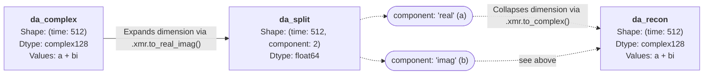

---
jupytext:
  text_representation:
    extension: .md
    format_name: myst
kernelspec:
  display_name: Python 3 (ipykernel)
  language: python
  name: python3
---

# Complex Number Handling

```{code-cell} ipython3
:tags: [remove-cell]

import matplotlib.pyplot as plt
import matplotlib_inline.backend_inline

matplotlib_inline.backend_inline.set_matplotlib_formats("retina")
plt.rcParams["figure.dpi"] = 150
```

## Handling Complex MRI/MRS Data

Magnetic resonance data is inherently complex-valued, but many standard tools lack native support for complex numbers. Splitting this data into separate real and imaginary channels is frequently required for:

* **Machine Learning:**

    Routing data through standard PyTorch or TensorFlow architectures.

* **Serialization:**

    Saving `xarray` datasets to disk, e.g. `da.to_netcdf()` and `xr.open_dataset()`.

* **Visualization:**

    Plotting real and imaginary components independently.


The `xmris` accessor provides dedicated utilities (`to_real_imag` and `to_complex`) to safely reshape and reconstruct complex `xarray.DataArray` objects while preserving all metadata and physical coordinates.

```{code-cell} ipython3
import matplotlib.pyplot as plt
import numpy as np
import xarray as xr

# Ensure the accessor is registered
import xmris
```

### 1. Splitting Complex Data into Channels



Let's generate a synthetic complex Free Induction Decay (FID) signal.

```{code-cell} ipython3
# Generate a synthetic complex FID
t = np.linspace(0, 1, 512)
complex_fid = np.exp(-t * 3.0) * np.exp(1j * 2 * np.pi * 15.0 * t)

da_complex = xr.DataArray(
    complex_fid,
    dims=["time"],
    coords={"time": t},
    attrs={"B0": 3.0},
    name="Signal",
)

print("Original Shape:", da_complex.shape)
print("Original Dtype:", da_complex.dtype)
```

By calling `.xmr.to_real_imag()`, the array is expanded with a new dimension containing the real and imaginary components.

```{code-cell} ipython3
da_split = da_complex.xmr.to_real_imag()

print("\nSplit Shape:", da_split.shape)
print("Split Dtype:", da_split.dtype)
da_split
```

The array cleanly expanded from `(512,)` to `(512, 2)`. Because it remains a standard `xarray.DataArray`, we can easily plot the two channels side-by-side.

```{code-cell} ipython3
fig, ax = plt.subplots(figsize=(8, 4))
da_split.plot.line(ax=ax, x="time", hue="component")
ax.set_title("FID Split into Real and Imaginary Components")
plt.show()
```

### 2. Customizing the Split Dimension

If your specific ML pipeline expects the channel dimension to have a specific name (e.g., `"channel"` instead of `"component"`), you can pass these arguments directly to the function.

```{code-cell} ipython3
da_torch = da_complex.xmr.to_real_imag(dim="channel", coords=("ch0", "ch1"))
print("Custom Dimension:", da_torch.dims)
```

### 3. Reconstructing the Complex Array

After processing the split channels (e.g., passing them through a neural network), you can seamlessly collapse the dimension back down to a standard complex array for downstream signal processing (like an FFT) using `.xmr.to_complex()`.

```{code-cell} ipython3
da_recon = da_split.xmr.to_complex()

is_identical = np.allclose(da_complex.values, da_recon.values)
print(f"Shape Restored: {da_recon.shape}")
print(f"Data Type Restored: {da_recon.dtype}")
print(f"Exact Mathematical Recovery: {is_identical}")
```

```{code-cell} ipython3
:tags: [remove-cell]

# STRICT TESTS FOR CI
assert da_split.ndim == da_complex.ndim + 1, "Dimension was not added."
assert da_split.sizes["component"] == 2, "Component dimension should have size 2."
assert not np.iscomplexobj(da_split.values), "Split array should be strictly real."
assert list(da_split.coords["component"].values) == ["real", "imag"]

assert da_recon.ndim == da_complex.ndim, "Reconstruction failed to drop dimension."
assert np.iscomplexobj(da_recon.values), "Reconstructed array should be complex."
assert "component" not in da_recon.dims, "Component dimension was not fully dropped."
np.testing.assert_array_equal(da_recon.values, da_complex.values)
assert da_recon.attrs["B0"] == 3.0, "Reconstruction lost attributes."
```
