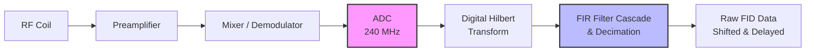

---
jupytext:
  text_representation:
    extension: .md
    format_name: myst
kernelspec:
  display_name: Python 3 (xmris)
  language: python
  name: python3
---

# Bruker - Digital Filter Group Delay

```{code-cell} ipython3
:tags: [remove-cell]

import matplotlib.pyplot as plt
import matplotlib_inline.backend_inline

# 1. Use retina for crisp, PDF-like text that never disappears in HTML
matplotlib_inline.backend_inline.set_matplotlib_formats("retina")

# 2. Set a high baseline DPI
plt.rcParams["figure.dpi"] = 150
```

If you have ever loaded raw Bruker spectroscopy data and wondered why your Free Induction Decay (FID) starts with a strange, wavy flatline instead of a sharp peak — or why your uncorrected spectrum looks like a spinning corkscrew  — you have encountered the **digital filter group delay**.

This is not a glitch or a bad acquisition. It is a direct physical byproduct of how modern spectrometers digitize and filter high-frequency radio signals. To understand how to fix it, we first need to look under the hood.

## The Hardware Pipeline

In modern MRI and MRS, analog-to-digital conversion (ADC) happens much faster than your final requested dwell time. The Bruker AVANCE NEO, for example, is a fully digital hardware system.

When your signal is detected, it is mixed down to a suitable frequency band and sampled at a massive rate (often 240 MHz or higher). To reduce this firehose of data down to your specific sweep width, the system uses a cascade of configurable Finite Impulse Response (FIR) filters implemented in an FPGA, combined with downsampling (decimation).



## The "Causality" Problem

The FIR filters used to clean up the signal are symmetric to ensure a constant group delay across all frequencies.

:::{dropdown} Deep Dive: What exactly is "Group Delay"?

In digital signal processing, **delay** is simply the time it takes for a signal to pass through a filter.

While only one physical signal—the FID—enters the filter, that FID is mathematically a **"group" of many different frequencies** .

If a filter processed high frequencies faster than low frequencies, the internal components of your FID would get out of sync, physically smearing and distorting the shape of the wave.

To prevent this, Bruker designs their filters to be perfectly symmetrical. A strict mathematical rule is that symmetric filters possess a **constant group delay**. This means every single frequency making up your FID is delayed by the *exact same amount of time*. Your FID stays perfectly intact; it is just shifted in time by N points.
:::

However, because a symmetric filter calculates a moving average using points *before* and *after* a given moment in time, it cannot output the "center" of the data until its entire filter window has filled up.

When the sudden, sharp burst of your FID hits this empty filter, it takes a fraction of a millisecond to "wake up." The output ramps up in a wavy step response , effectively delaying the start of your true signal by a specific number of data points.

For spectroscopy, Bruker prioritizes absolute raw data transparency. Rather than artificially truncating this transient or hiding points from the user, the system passes the raw, uncompensated output directly to you. If left untouched, this time-domain shift results in a massive, rolling linear phase error in the frequency domain.

Let's use `xmris` to sanitize this raw hardware data and see exactly how to recover a pristine spectrum.

```{code-cell} ipython3
import matplotlib.pyplot as plt
import numpy as np
import xarray as xr

# Ensure the accessor is imported so .xmr is registered
import xmris
```

## 1. Generate Synthetic Bruker-like Data (Hardware Simulation)
Let's create an FID with a known group delay of 76.125 points.

We will physically simulate the hardware DSP. A symmetric FIR filter of length $L$ introduces an exact group delay of $(L-1)/2$ points. We will convolve our "ideal" FID with a low-pass FIR filter to naturally generate the integer delay and the wavy hardware transient, followed by a frequency-domain phase shift for the sub-point fraction.

```{code-cell} ipython3
:tags: [hide-input, andre]

n_points = 1000
dt = 0.001
time = np.arange(n_points) * dt
freq = 50.0  # 50 Hz signal
decay = 10.0

# 1. True signal (starts sharply at t=0)
true_fid = np.exp(-time * decay) * np.exp(1j * 2 * np.pi * freq * time)

# 2. Define the Bruker Group Delay (76.125 points)
delay_points = 76.125
int_delay = int(np.floor(delay_points))
frac_delay = delay_points - int_delay

# 3. Simulate the FIR Hardware Filter (Integer delay + Wavy Transient)
# A symmetric filter of length 2N + 1 has a delay of N points.
fir_length = 2 * int_delay + 1
n = np.arange(fir_length)

# Create a simple low-pass filter (windowed sinc)
alpha = 0.54  # Hamming window
window = alpha - (1 - alpha) * np.cos(2 * np.pi * n / (fir_length - 1))
sinc_filter = np.sinc(0.5 * (n - int_delay)) * window
sinc_filter /= np.sum(sinc_filter)  # Normalize gain

# Apply hardware filter via convolution
# mode='full' naturally simulates the empty filter filling up with the new signal
hardware_fid = np.convolve(true_fid, sinc_filter, mode="full")[:n_points]

# 4. Apply the fractional sub-point delay via Fourier phase shift
spectrum = np.fft.fft(hardware_fid)
freqs = np.fft.fftfreq(n_points)
shifted_spectrum = spectrum * np.exp(-1j * 2 * np.pi * freqs * frac_delay)
delayed_fid = np.fft.ifft(shifted_spectrum)

# Package into xarray
da_raw = xr.DataArray(
    delayed_fid,
    dims=["Time"],
    coords={"Time": time},
    attrs={"units": "a.u.", "description": "Raw Bruker Data"},
)

fig, ax = plt.subplots(figsize=(8, 4))
da_raw.real.plot(ax=ax, label="Delayed (Raw)", alpha=0.7)
ax.set_title("Time Domain: Simulated Hardware FIR Transient")
ax.legend()
plt.show()
```

## 2. Apply xmris Correction
We can easily sanitize this hardware-specific data using the `.xmr.remove_digital_filter()` method. We use `keep_length=True` to pad the end with pure zeros, maintaining our exact array length for FFTs. This approach allows us to chain operations directly on the ingested array.

```{code-cell} ipython3
# 1. Sanitize the vendor-specific data using the accessor
da_clean = da_raw.xmr.remove_digital_filter(
    group_delay=delay_points, dim="Time", keep_length=True
)

# Plotting the Time Domain Result
fig, (ax_start, ax_end) = plt.subplots(figsize=(10, 3), ncols=2, sharey=True)

da_raw.real.plot(ax=ax_start, label="Raw (Delayed)", alpha=0.5)
da_clean.real.plot(ax=ax_start, label="Cleaned (xmris)", linewidth=2)
ax_start.set_xlim(-0.01, 0.2)
ax_start.set_title("Digital Filter Removed - FID Start")

da_raw.real.plot(ax=ax_end, label="Raw (Delayed)", alpha=0.5)
da_clean.real.plot(ax=ax_end, label="Cleaned (xmris)", linewidth=2)
ax_end.set_title("FID End")
ax_end.set_xlim(0.8, 1.05)
ax_end.legend()


plt.show()
```

## 3. Spectral Comparison (Naive vs. Clean)
A time shift corresponds to a linear phase shift. With a delay of ~76 points, the phase wraps around the unit circle 76 times across the spectral width!

Using the `.xmr.to_spectrum()` accessor, let's compare a naive FFT of the raw data versus an FFT of our sanitized data. We plot the **real** part to expose the severe phase twist.

```{code-cell} ipython3
# Transform both arrays to the frequency domain using the xmris accessor
spec_raw = da_raw.xmr.to_spectrum(dim="Time", out_dim="Frequency")
spec_clean = da_clean.xmr.to_spectrum(dim="Time", out_dim="Frequency")

# Plotting the Frequency Domain Result
fig, (ax1, ax2) = plt.subplots(1, 2, figsize=(12, 4), sharey=True)


# Naive FFT
spec_raw.real.plot(ax=ax1, color="tab:red")
ax1.set_title("Naive FT (Uncorrected)\nMassive 1st Order Phase Error")

# Cleaned FFT
spec_clean.real.plot(ax=ax2, color="tab:blue")
ax2.set_title("xmris FT (Corrected)\nPure Absorptive Peak")

plt.tight_layout()
plt.show()
```

```{code-cell} ipython3
:tags: [remove-cell]

# CRITICAL ASSERTIONS FOR NBMAKE CI
# 1. Purity & Lineage checks
assert da_clean is not da_raw, "Function mutated data in place!"
assert "digital_filter_removed" in da_clean.attrs
assert da_clean.attrs["group_delay_removed"] == 76.125
assert da_clean.attrs["length_retained_with_zeros"] is True
assert da_clean.attrs["description"] == "Raw Bruker Data", (
    "Original attributes were lost!"
)

# 2. Dimensionality checks
assert da_clean.sizes["Time"] == 1000, "keep_length failed to maintain length."
np.testing.assert_allclose(
    da_clean.coords["Time"].values[0], 0.0, err_msg="Time coordinate not reset to 0"
)

# 3. Math checks (The zero filled region at the end should be strictly zero)
np.testing.assert_allclose(
    da_clean.values[-76:],
    0.0,
    atol=1e-12,
    err_msg="End of array was not zero-filled correctly",
)

# 4. Phase check in Time Domain
# Because the FIR filter "smears" the sharp starting spike, amplitude drops from 1.0 to ~0.77.
# We care that the phase is corrected, meaning the signal is primarily REAL and POSITIVE.
first_point = da_clean.values[0]
assert first_point.real > 0.5, (
    f"Real part {first_point.real} is too low (expected positive absorptive start)"
)
assert abs(first_point.imag) < 0.2, f"Imag part {first_point.imag} is not minimized"

# 5. Peak purity check in Frequency Domain
# Use np.argmax on the underlying numpy array to avoid xarray FutureWarnings
max_idx = np.argmax(abs(spec_clean).values)
peak_val = spec_clean.values[max_idx]

# The real part should strictly dominate the peak if perfectly phased
assert peak_val.real > 0, "Peak is not absorptive (real part is negative or zero)."
assert abs(peak_val.imag) < (peak_val.real * 0.15), (
    "Clean spectrum has residual phase error at the peak."
)
```

(measuring-the-group-delay)=
## 4. When the Header Lies: Measuring the Group Delay

Everything above assumed we *know* the group delay. In practice we read it from the
Bruker header (`ACQ_RxFilterInfo`[0], the `groupDelay`). But for some ParaVision
version / probe combinations that header value **under-counts** the true digital-filter
delay — the console reports fewer transient points than it actually inserted.

Removing only the header's delay therefore leaves a few samples of *unremoved* filter
transient at the start of the FID. Because a leftover time shift $\Delta d$ (in samples)
is a **linear phase** in the frequency domain,

$$\varphi(f) \;=\; \varphi_0 \;+\; 2\pi\,\Delta d\,\frac{f}{f_س}\,,$$

the error is ~0 at the carrier ($f=0$) but grows with offset. Near-carrier peaks look
fine; peaks far away are silently phase-twisted — which biases peak areas and tied-phase
fits.

The fix is to **measure** the delay from the data instead of trusting the header. The
correct delay is the one that, after removal, makes the whole spectrum absorptive under a
*single* zero-order phase — `.xmr.estimate_group_delay()` searches for exactly that.

:::{important}
Do **not** estimate the delay from `argmax(|FID|)`. The filter transient *rings*, so the
FID magnitude has several local maxima clustered around (not on) the true delay — the peak
of `|FID|` lands on a ringing lobe.
:::

### A dataset with a wrong header

We build a **three-peak** FID with a known true delay of **84** samples, but label it with
the wrong header value **76.125** — a realistic ~8-sample under-count.

```{code-cell} ipython3
:tags: [hide-input]

n_gd = 2048
sw_hz = 5000.0
dt_gd = 1.0 / sw_hz
t_gd = np.arange(n_gd) * dt_gd

# Three peaks at incommensurate offsets (like a 13C urea/alanine/lactate slab)
peaks_hz = [20.0, 436.0, 651.0]
amps = [1.0, 0.6, 0.8]
ideal = sum(
    a * np.exp(-t_gd * 30.0) * np.exp(1j * 2 * np.pi * f0 * t_gd)
    for f0, a in zip(peaks_hz, amps)
)

# Insert a TRUE group delay of 84 samples via a symmetric windowed-sinc FIR filter
TRUE_DELAY = 84
L = 2 * TRUE_DELAY + 1
k = np.arange(L)
win = 0.54 - 0.46 * np.cos(2 * np.pi * k / (L - 1))
fir = np.sinc(0.5 * (k - TRUE_DELAY)) * win
fir /= fir.sum()
raw = np.convolve(ideal, fir, mode="full")[:n_gd]

WRONG_HEADER = 76.125  # what the console reports — an ~8-sample under-count
da_gd = xr.DataArray(
    raw,
    dims=["time"],
    coords={"time": t_gd},
    # `bruker_group_delay` is the attribute the Bruker loader writes into .attrs
    attrs={"units": "a.u.", "bruker_group_delay": WRONG_HEADER},
)
```

### Measure it

```{code-cell} ipython3
# Reads the header from .attrs as its search anchor, then measures the true delay.
# It warns because the measured value contradicts the header — the whole point here.
measured_delay, profile = da_gd.xmr.estimate_group_delay(return_profile=True)

print(f"header  (reported): {WRONG_HEADER}")
print(f"measured (true)   : {measured_delay:.2f} samples")
```

The cost profile shows a single sharp minimum at the true delay. The header sits ~8 samples
short of it, and `argmax(|FID|)` lands on a ringing lobe — not the minimum.

```{code-cell} ipython3
argmax_fid = int(np.argmax(np.abs(da_gd.values)))

fig, ax = plt.subplots(figsize=(8, 4))
profile.plot(ax=ax, marker=".", color="tab:blue", label="residual-phase cost")
ax.axvline(measured_delay, color="tab:green", lw=2, label=f"measured ({measured_delay:.1f})")
ax.axvline(WRONG_HEADER, color="tab:red", ls="--", label=f"header ({WRONG_HEADER})")
ax.axvline(argmax_fid, color="0.5", ls=":", label=f"argmax|FID| ({argmax_fid})")
ax.set_xlabel("trial group delay (samples)")
ax.set_ylabel("residual first-order phase cost")
ax.set_title("Group-delay estimation: cost vs. trial delay")
ax.legend()
plt.show()
```

### Header vs. measured, and the aliasing trap

We remove each delay, transform, and apply **only** a zero-order phase (`p0_only=True`).
Any residual *first-order* phase then remains visible. With the header value the far peaks
are twisted; with the measured value the whole spectrum is cleanly absorptive.

```{code-cell} ipython3
spec_header = (
    da_gd.xmr.remove_digital_filter(group_delay=WRONG_HEADER)
    .xmr.to_spectrum()
    .xmr.autophase(p0_only=True)
)
spec_measured = (
    da_gd.xmr.remove_digital_filter(group_delay="measure")  # <- estimate + remove in one call
    .xmr.to_spectrum()
    .xmr.autophase(p0_only=True)
)

fig, (axh, axm) = plt.subplots(1, 2, figsize=(12, 4), sharey=True)
spec_header.real.plot(ax=axh, color="tab:red")
axh.set_title("Header delay (76.125)\nresidual twist on far peaks")
spec_measured.real.plot(ax=axm, color="tab:blue")
axm.set_title("Measured delay (~84)\npure absorption everywhere")
for ax in (axh, axm):
    for f0 in peaks_hz:
        ax.axvline(f0, color="0.7", lw=0.8, zorder=0)
plt.tight_layout()
plt.show()
```

:::{note}
Look closely at the header panel: the **436 Hz** peak is badly twisted, yet the **651 Hz**
peak looks almost fine. That is *aliasing* — at 651 Hz the residual linear phase happens to
wrap by nearly a full turn ($2\pi$), so a naive two-peak check on the wrong pair would
conclude the delay is correct. `estimate_group_delay` avoids this by scoring the **whole**
spectrum (all peaks and the baseline at once), not a single peak pair.
:::

```{code-cell} ipython3
:tags: [remove-cell]

# CRITICAL ASSERTIONS FOR NBMAKE CI
from xmris.vendor.bruker import _PHI0_GRID, _residual_phase_cost


def _resid(d):
    """Whole-spectrum residual first-order phase cost after removing delay `d`."""
    spec = da_gd.xmr.remove_digital_filter(group_delay=d).xmr.to_spectrum()
    return _residual_phase_cost(spec, "frequency", "acme", _PHI0_GRID)


def _peak_phase_deg(d, f0, half=40.0):
    spec = da_gd.xmr.remove_digital_filter(group_delay=d).xmr.to_spectrum()
    seg = spec.sel(frequency=slice(f0 - half, f0 + half))
    return np.degrees(np.angle(seg.values[int(np.abs(seg).values.argmax())]))


def _wrap(x):
    return (x + 180.0) % 360.0 - 180.0


# 1. Recovery: the estimator finds the true delay to sub-sample precision.
assert abs(measured_delay - TRUE_DELAY) < 0.5, f"expected ~{TRUE_DELAY}, got {measured_delay}"
assert float(profile.trial_delay[int(profile.argmin())]) == TRUE_DELAY, "profile min off truth"

# 2. Measured beats the header on residual first-order phase (whole-spectrum).
assert _resid(measured_delay) < 0.3 * _resid(WRONG_HEADER), "did not beat the header"

# 3. argmax(|FID|) is unreliable: its delay leaves far more residual phase.
argmax_fid = int(np.argmax(np.abs(da_gd.values)))
assert argmax_fid != TRUE_DELAY, "argmax coincidentally hit the true delay"
assert _resid(float(argmax_fid)) > 10.0 * _resid(measured_delay), "argmax not clearly worse"

# 4. The aliasing trap: with the WRONG header the mid peak exposes the error while the
#    far peak is aliased (~2pi wrap) and looks fine — motivating whole-spectrum scoring.
spread_mid = _wrap(_peak_phase_deg(WRONG_HEADER, 436.0) - _peak_phase_deg(WRONG_HEADER, 20.0))
spread_far = _wrap(_peak_phase_deg(WRONG_HEADER, 651.0) - _peak_phase_deg(WRONG_HEADER, 20.0))
assert abs(spread_mid) > 50.0, f"mid peak should expose the header error, got {spread_mid:.1f}"
assert abs(spread_far) < 30.0, f"far peak should be aliased/benign, got {spread_far:.1f}"

# 5. With the measured delay, all peaks share one phase (no first-order residual).
spread_mid_ok = _wrap(_peak_phase_deg(measured_delay, 436.0) - _peak_phase_deg(measured_delay, 20.0))
assert abs(spread_mid_ok) < 40.0, f"measured delay left first-order residual: {spread_mid_ok:.1f}"

# 6. Lineage: the "measure" sentinel records the measured (not header) delay.
_meas_attr = da_gd.xmr.remove_digital_filter(group_delay="measure").attrs["group_delay_removed"]
assert abs(_meas_attr - TRUE_DELAY) < 0.5, "measure sentinel did not remove the measured delay"
```
